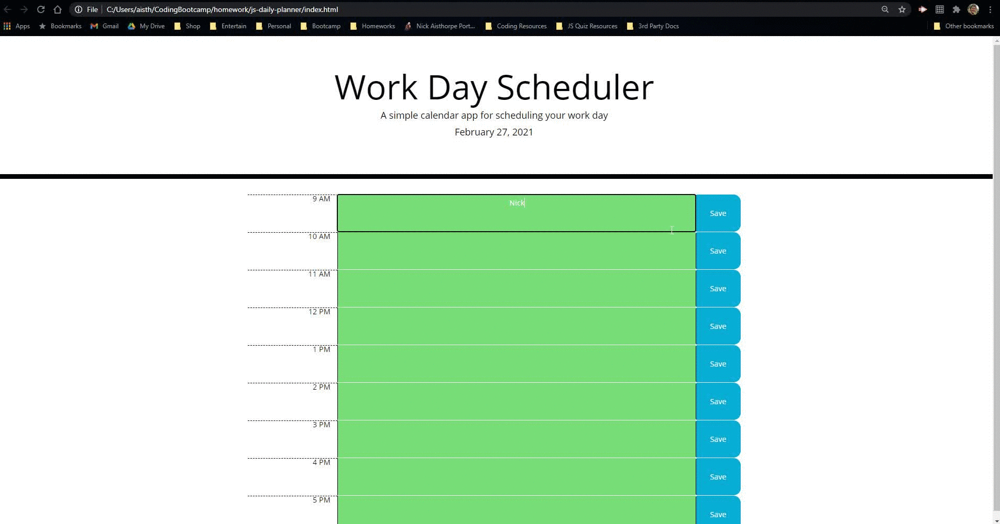

# js-daily-planner

## What
### This is a daily planner for tracking past, current, and upcoming tasks built with HTML, CSS, and JS.

---------
## Why
### This was an exercise in using jQuery, Moment JS, and other 3rd party JS API's. 

--------------
## How 
### I started by making the correct date display on the jumbotron using moment. From there I set the current time using moment in a 24 hour format. I then compared the current time with the planner times, and added classes to change the properties of the text input area. (Gray is past, red is present, green is future.) Once that was working properly, I set up an event listener to save input text and stored it locally so that it persists.

------------
## Site Link
### https://naisthorpe.github.io/js-daily-planner/
-------------
## Site Screenshot
